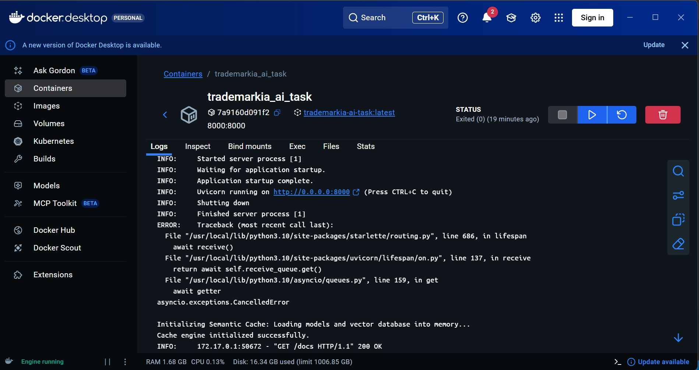
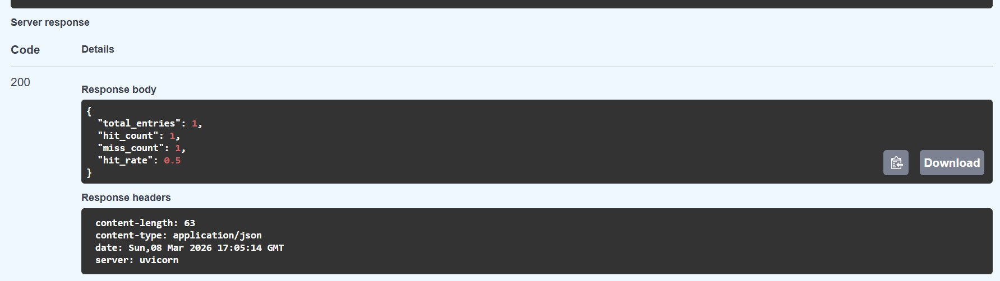

# Trademarkia Semantic Search & Cache Engine

A high-performance, first-principles semantic search engine built on the 20 Newsgroups dataset. This project provides:

* Fuzzy clustering via Gaussian Mixture Models (GMM).
* A partitioned, cluster-routed semantic cache for sub-linear lookup performance.
* A containerized FastAPI service with persistent model/state initialization for low-latency queries.

---

## Table of contents

* [System overview](#system-overview)
* [Quick start](#quick-start)

  * [Option A — Docker (recommended)](#option-a---docker-recommended)
  * [Option B — Local environment](#option-b---local-environment)
* [Architecture & engineering notes](#architecture--engineering-notes)

  * [Preprocessing & embeddings](#preprocessing--embeddings)
  * [Fuzzy clustering (GMM)](#fuzzy-clustering-gmm)
  * [Semantic cache design](#semantic-cache-design)
  * [Service & state management (FastAPI)](#service--state-management-fastapi)
* [API reference](#api-reference)

  * [`POST /query`](#post-query)
  * [`GET /cache/stats`](#get-cachestats)
  * [`DELETE /cache`](#delete-cache)
* [Example outputs & terminal logs](#example-outputs--terminal-logs)
   * [Screenshots](#screenshots)

---

## System overview

The engine follows a 4-stage pipeline:

1. **Preprocessing** — strip headers, quoted text, and routing metadata so embeddings reflect semantic content.
2. **Clustering** — dimensionality reduction (PCA) → GMM to produce *soft* cluster assignments (probability vectors).
3. **Caching** — cluster-routed dictionary-based cache that partitions documents by dominant cluster for faster lookups.
4. **Service layer** — FastAPI app that initializes heavy objects (embedding model, PCA, GMM, vector store) once at module import to avoid repeated loading.

---

## Quick start

> **Prerequisite:** Make sure you have the `20_newsgroups` dataset folder extracted in the project root (same level as `main.py`, `engine.py`, etc.).

### Option A — Docker (recommended)

1. Build and run the stack:

```bash
docker-compose up --build
```

2. When the container is up, the API will be available at `http://localhost:8000`.

> Note: The Dockerfile in this repository downloads the sentence-transformers model at build time to reduce runtime cold-start latency. This makes the container heavier but avoids the first-query model download when the container starts.

**Common docker-compose commands**

```bash
# Build and run in background
docker-compose up --build -d

# View logs
docker-compose logs -f

# Stop and remove
docker-compose down
```

### Option B — Local environment

1. Create & activate a Python virtual environment:

```bash
python -m venv venv
# Linux / macOS
source venv/bin/activate
# Windows (PowerShell)
.\venv\Scripts\Activate.ps1
```

2. Install dependencies:

```bash
pip install -r requirements.txt
```

3. Ingest & train (this script will create `.pkl` artifacts and a local vector store):

```bash
python engine.py
```

4. Start the API server:

```bash
uvicorn main:app --host 0.0.0.0 --port 8000 --reload
```

> First run may take a few minutes: embedding model files are downloaded and artifacts are generated.

---

## Architecture & engineering notes

### Preprocessing & embeddings

* **Cleaning strategy:** `clean_document()` removes legacy email headers by splitting at the first double-newline and strips quoted reply lines beginning with `>` to focus on the author's semantic content.
* **Embedding model:** `all-MiniLM-L6-v2` (384-dimensional). This is CPU-friendly and provides reliable cosine similarity for natural language queries.

### Fuzzy clustering (GMM)

* **Why GMM?** GMM provides soft/probabilistic cluster assignments — documents can belong to multiple topics with different weights, which matches real-world semantic overlap.
* **Dimensionality reduction:** PCA from 384 → 50 dimensions to improve GMM density estimates and speed.
* **Cluster count:** K chosen as 15 (not 20). Several original newsgroups overlap semantically; K=15 provides broader semantically-cohesive neighborhoods.

### Semantic cache design

* **In-memory, Redis-free:** The cache uses a Python dict partitioned by dominant cluster. This keeps the implementation simple and easy to inspect.
* **Cluster routing complexity:** Incoming queries are routed to the dominant cluster (or top-k clusters) to reduce search space from O(N) to roughly O(N/K).
* **Threshold:** Default threshold = 0.75 (tunable). Rationale: balances precision and recall for natural language synonyms.

### Service & state management (FastAPI)

* Heavy objects are loaded at module import in `main.py` so they remain singletons for the lifetime of the process. Endpoints are stateless wrt HTTP requests but rely on pre-initialized model state.

---

## API reference

### `POST /query`

**Body**

```json
{ "query": "What is the best graphics card?" }
```

**Behavior**

* Embeds the query, maps it into PCA space, gets cluster probabilities from GMM, routes to the appropriate cache bucket(s), and returns cached results on hits or performs a vector search on miss and then caches the new result.

**Example response**

```json
{
  "query": "What is the best graphics card?",
  "cached": false,
  "results": [
    {
      "id": "comp.graphics-12345",
      "score": 0.873,
      "snippet": "I recommend the latest series of GPUs for gaming and ML workloads...",
      "source": "20_newsgroups/comp.graphics"
    }
  ]
}
```

### `GET /cache/stats`

**Behavior**: Returns cache metrics.

**Example response**

```json
{
  "total_entries": 4123,
  "hit_count": 2340,
  "miss_count": 1783,
  "hit_rate": 0.567
}
```

### `DELETE /cache`

**Behavior**: Clears the in-memory cache and resets statistics.

**Example response**

```json
{
  "status": "ok",
  "message": "Cache flushed, stats reset to zero."
}
```

---

## Example outputs & terminal logs

Below are representative examples you can expect when running the project. These are **examples only** — your real log/output values will depend on dataset size and runtime environment.

**Docker container startup (representative logs)**

```
Step 1/10 : FROM python:3.11-slim
...
Successfully built <image-id>
Successfully tagged trademarkia-semantic:latest
Creating trademarkia_semantic_search_1 ... done
Attaching to trademarkia_semantic_search_1
semantic-search_1  | INFO:     Started server process [1]
semantic-search_1  | INFO:     Waiting for application startup.
semantic-search_1  | INFO:     Uvicorn running on http://0.0.0.0:8000 (Press CTRL+C to quit)
semantic-search_1  | INFO:     Application startup complete.
```

**Example output from `python engine.py` (training / analysis)**

```
INFO: Loading 11,314 documents from 20_newsgroups
INFO: Cleaning documents (headers & quoted text removed)
INFO: Computing embeddings (all-MiniLM-L6-v2) [CPU]
INFO: Running PCA: 384 -> 50 dims
INFO: Fitting GMM with K=15
INFO: GMM converged after 34 iterations
INFO: Saving artifacts: embeddings.pkl, pca.pkl, gmm.pkl, vectors.db
INFO: Initializing cluster-routed cache (0 entries)
INFO: Ready — engine initialized in 2m 18s
```

**Example terminal output for a sample query to the API**

```
$ curl -X POST -H "Content-Type: application/json" -d '{"query":"best GPU for ML"}' http://localhost:8000/query
{
  "query": "best GPU for ML",
  "cached": true,
  "results": [ ... ]
}
```

---

## Troubleshooting

* **Model download fails in Docker**: Ensure the container has outbound network access during `docker-compose build`. If this is restricted in your environment, run `engine.py` locally to download the model and copy artifacts into the image build context.
* **Port conflicts**: If `8000` is in use, change `--port` in the `uvicorn` command or remap ports in `docker-compose.yml`.
* **Memory errors**: Use a smaller embedding model or increase container/machine memory. Optionally reduce batch sizes during embedding calculation.


## Screenshots 

### Docker Container Running

### GET /cache/stats API Response



